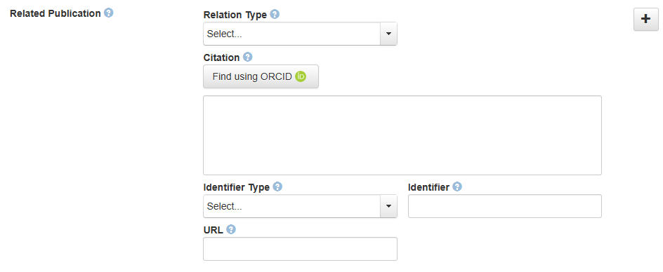
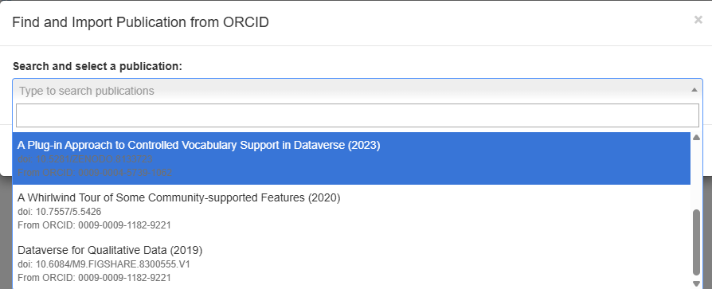
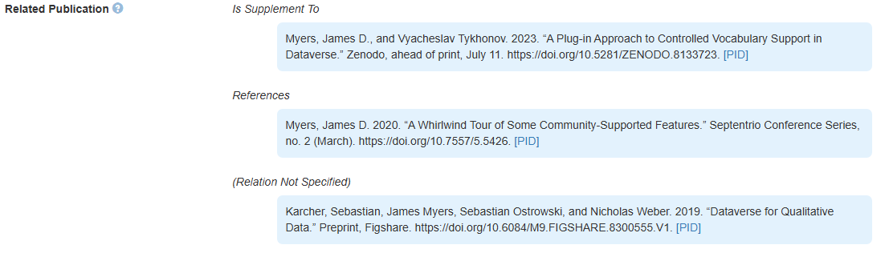

## Related Publications Example

This example manages the **Related Publications** field, providing ORCID-based lookup for a person’s publications while still allowing free-text entries and manual identifier entry where needed.

If AUthor ORCIDs have been entered, a 'Find Using ORCID' button is displayed:

Using it, you can select from any of the author's publications:

and on the metadata pane, the related publication citations will have an improved layout:

The script uses the `publication` protocol and is intended for Dataverse installations that support the Related Publications field and the associated managed fields.

This example requires several files:

- `scripts/i18n/publications_*.json` : translation of the script's messages (please contribute transalations to other languages!)
- `scripts/publications.js` : the JavaScript file that modifies standard Dataverse behavior
- `scripts/cvocutils.js` : the JavaScript file that modifies standard Dataverse behavior
  
(These scripts also use jQuery, Select2, and Citation.js, which are already included or loaded by the script.)

### How to install

- load the `publications.json` file in the `:CVocConf` setting using the [Dataverse API](https://guides.dataverse.org/en/latest/installation/config.html#cvocconf). For example, using curl:

  `curl -X PUT --upload-file publications.json http://localhost:8080/api/admin/settings/:CVocConf`
- 
- For production use, use the compose* scripts or manually add this JSON object to the array in your existing `:CVocConf` setting.
- Refresh your browser page

After that, you should see a **Find using ORCID** button next to the Related Publications citation field, provided that at least one author on the dataset has an ORCID value.

### What it does

- searches publications from the ORCID profiles of the authors on the dataset
- lets the user pick one publication from a searchable dropdown
- fills in the publication identifier field
- fills in the managed citation field
- fills in the managed URL field when available
- supports free-text publication entries when no ORCID result is available

### Notes

- The script helps by **importing publication metadata from ORCID**. It does not continuously synchronize the publication with ORCID.
- The script attempts to build a citation from DOI-based records using Citation.js (currently hardcoded to 'chicago-author-date' in the script), and falls back to ORCID citation data or a basic citation format if needed.
- If no ORCID values are present for authors, the script displays a small hint encouraging users to add ORCIDs first.